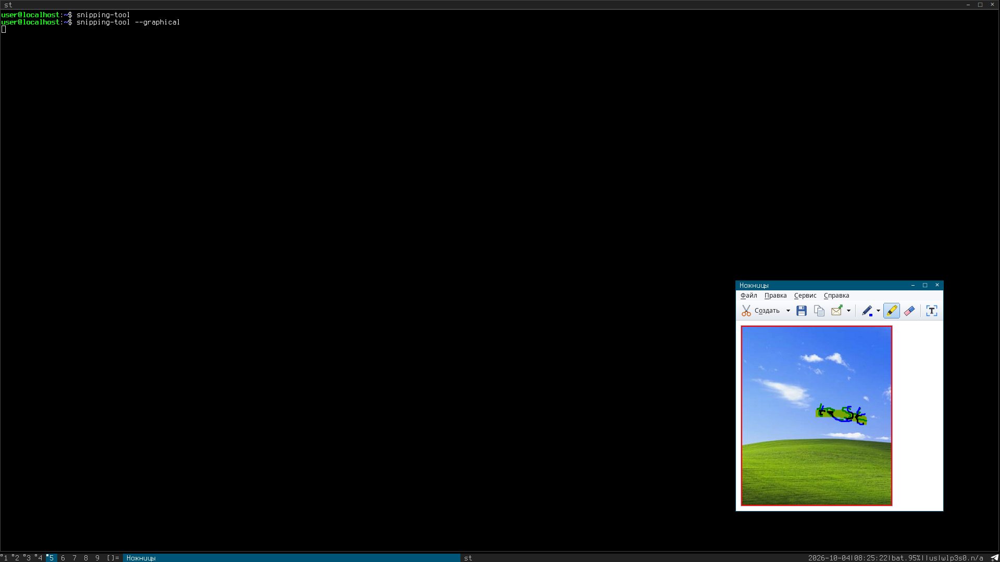

# Snipping Tool for Linux

That classic Snipping Tool from Windows... but for Linux.

How to install? Go [here](##build)



---

## Build

Do:
```
git clone https://github.com/drvptr/Snipping-Tool
cd Snipping-Tool
make install
```

That's all. You would have to use:
```
./sipping-tool
```

---

## CLI mode (default)

You would have to use the next commands:
```bash
snipping-tool       # rectangle -> clipboard (like scrot -s -F - | xclip -sel clip -t image/png);
snipping-tool -f    # whole screen, no selection
snipping-tool -w    # active window with its frame, no selection
snipping-tool -l    # free-form selection
snipping-tool -s    # also save the snip in $HOME (prints the path)
snipping-tool -o x.png  # also save the snip in x.png (- is stdout)
snipping-tool -d 3  # wait 3 seconds first
snipping-tool -t    # recognize the text: print it and put it on the clipboard instead of the image
snipping-tool -t -i x.png   # recognize the text of a PNG file
snipping-tool -n    # leave the clipboard alone
snipping-tool -g    # the graphical version (= --graphic). 
```

Esc or the right mouse button cancels the selection. For dwm (config.h):
```c
{ 0, XK_Print, spawn, SHCMD("snipping-tool") },
{ ShiftMask, XK_Print, spawn, SHCMD("snipping-tool -w") },
{ MODKEY,XK_Print, spawn, SHCMD("snipping-tool -t") },
```

## Graphical version

You have to start it by following command
```bash
snipping-tool --graphic
```

A small window: New (the arrow next to it chooses the snip type),
Cancel (active during the delay), Options, and the instruction text with
a help button. After a snip it becomes the markup window with the menus
File, Edit, Tools and Help and the toolbar New, Save, Copy, Send | Pen,
Highlighter, Eraser | Recognize Text.

Keys: Ctrl+N new snip, Ctrl+S save, Ctrl+C copy, Ctrl+Z undo a mark,
Ctrl+T recognize text, Ctrl+Q quit, F1 help, F10 and Alt with the
underlined letter for the menus and buttons (also while a second,
non-Latin keyboard layout is on), mouse wheel and arrows scroll (Shift+wheel scrolls sideways). Tab
completes the path in the Save As dialog.

An X11 clipboard lives as long as its owner, so every copy starts a small
background process that hands out the image and quits when another
program takes the clipboard. The snip stays on the clipboard after the
program is closed.

---

## Modifications

The icons are ordinary PNG files in the icons/ directory (any color type,
RGBA with transparency is best). They are drawn for this program; the
original Windows icons are not used. To replace one:

1. put a PNG with the same name and size into icons/:

| File | Rezolution | Comment |
| --- | --- | --- |
| `new.png` | 24x24 | New (scissors) |
| `cancel.png` | 24x24 | Cancel |
| `options.png` | 24x24 | Options |
| `save.png` | 24x24 | Save |
| `copy.png` | 24x24 | Copy |
| `send.png` | 24x24 | Send |
| `pen.png` | 24x24 | Pen |
| `marker.png` | 24x24 | Highlighter |
| `eraser.png` | 24x24 | Eraser |
| `ocr.png` | 24x24 | Recognize Text |
| `help.png` | 16x16 | help button |
| `app16.png` | 16x16 | window icon (_NET_WM_ICON) |
| `app32.png` | 32x32 | window icon, message boxes |
| `app48.png` | 48x48 | window icon and the desktop menu (make install) |

2. make icons - makes icons.h again with xxd -i (xxd comes with vim or as a package of its own); by hand it is:

```bash
cd icons && for f in *.png; do xxd -i $f; done > ../icons.h
```

The names of the arrays come from the file names (new.png -> new_png, new_png_len), so the file names must stay.

---

## Files

| File | Comment |
| --- | --- |
| `snip.c` | main, command line, screen capture, selection, clipboard owner, saving, settings |
| `gui.c` | the graphical version |
| `png.c` | PNG: deflate with dynamic Huffman codes, and inflate |
| `ocr.c` | text recognition |
| `snip.h` | shared declarations |
| `config.def.h` | build settings (copied to config.h) |
| `icons.h` | icons (make icons from icons/*.png) |
| `font.h` | font of the interface (tools/mkfont.py) |
| `ocrdb.h` | letter samples for the OCR (tools/mkocrdb.py) |

---

# License

GNU GPL version 2 or later; the parts of scrot are MIT, the Noto Sans font is SIL OFL 1.1.
